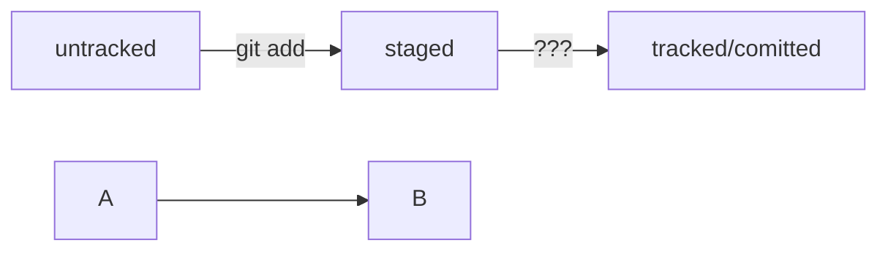

# Git — знание, которым хочется поделиться со всем миром! 

## 1. Создание репозитария.
### 1.1. Создание локального репозитария.
 
Чтобы Git начал отслеживать изменения в проекте, папку с файлами этого проекта 
нужно сделать Git-репозиторием (от англ. repository — «хранилище»). 
Для этого следует переместиться в неё и ввести команду git init (от англ. initialize — «инициализировать»).  
$ git init

### 1.2. Синхронизация локальног и удаленного репозитариев.
$ git remote add origin https://github.com/YandexPracticum/first-project.git 

проверить связь репозитариев:  
$ git remote -v

в первый раз загрузи все коммиты из локального репозитория в удалённый с названием origin. 
$ git push -u origin master

склонируй репозиторий с URL the-great-project.git из аккаунта TheGreatOwner на мой локальный компьютер. 
$ git clone git@github.com:TheGreatOwner/the-great-project.git

«Форк» — операция, которая не связана с Git напрямую и выполняется через графический интерфейс GitHub  
(кнопка Fork в правом верхнем углу страницы репозитория).  
«Форк» создаёт независимую копию репозитория  
со всеми файлами, коммитами и ветками в аккаунте GitHub.  
Такая копия будет полностью независима.  
Внесённые изменения не будут синхронизированы с исходным репозиторием. 

## 2. Работа с файлами репозитария

### 2.1. Подготовка файлов для сохранения
 
$ git add *имя_файла*  
или  
$ git add --all   
Также можно добавить текущую папку целиком — в этом случае все файлы в ней 
тоже будут добавлены. Обратиться к текущей папке в Bash позволяет точка (.). 
$ git add .  
 

 

## 4. Хеш, лог и HEAD
### 4.1. Хэш
 
Хеш — идентификатор коммита. 
- если хеш получить дважды для одного и того же набора входных данных, 
  то результат будет гарантированно одинаковый;
- если хоть что-то в исходных данных поменяется (хотя бы один символ), 
  то хеш тоже изменится (причём сильно).
 

### 4.2. Исследуем лог.
Вызов  
$ git log  

Сокращённый лог вызывают командой git log с флагом --oneline 
(англ. «одной строкой»). При этом в терминале появятся только первые 
несколько символов хеша каждого коммита и комментарии к ним. 
$ git log --oneline  

